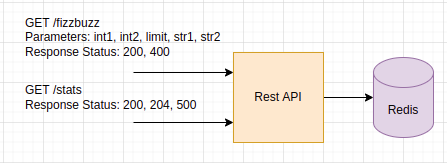

## Fizz-Buzz

## Table of Contents

- [Goals](#goals)
- [Architecture](#architecture)
- [Design considerations](#design-considerations)
- [Application Architecture](#application-architecture)
- [Testing Strategy](#testing-strategy)
- [Setup](#setup)
  - [Requirements](#Requirements)
  - [Run](#Run)
- [Quality code](#quality-code)
  - [Testing](#testing)
  - [Linting](#linting)
- [Documentation](#documentation)

### Goal 

Your goal is to implement a web server that will expose a REST API endpoint that: 
Accepts five parameters : three integers int1, int2 and limit, and two strings str1 and str2.

Returns a list of strings with numbers from 1 to limit, where: all multiples of int1 are replaced by str1, all multiples of int2 are replaced by str2, all multiples of int1 and int2 are replaced by str1str2.

The server needs to be:
- Ready for production
- Easy to maintain by other developers
- Add a statistics endpoint allowing users to know what the most frequent request has been. 

This endpoint should:
- Accept no parameter
- Return the parameters corresponding to the most used request, as well as the number of hits for this request"

### Implementation

This is an HTTP server that computes the result of fizzbuzz from given parameters. It stores the result into a caching layer (Redis). The result can be retrieved through an HTTP GET request. It thrives to follow the [Onion architecture principles](https://www.thinktocode.com/2018/08/16/onion-architecture/). It will be discussed further down.

### Architecture



Even though, the server could have used an inmemory layer to store statistics, I leaned towards an external database as it should be production ready, that is to say handle down time without losing data.

Talking about inmemory store, it could have been an intermediate solution for a first iteration. Go offers [Sync.Map](https://pkg.go.dev/sync#Map) as first class concurrent safe map.

### Design considerations

A web server can handle [parallel requests](https://www.oreilly.com/library/view/http-the-definitive/1565925092/ch04s04.html), as such our server implementation has to be concurrent safe. Since [version 6](https://www.infoworld.com/article/3541356/redis-6-arrives-with-multithreading-for-faster-io.html), Redis supports multiple threads. As such, the implementation made use of a mutex to limit the access of goroutines to the storage layer. Go offers [RWMutex](https://pkg.go.dev/sync#RWMutex), which allows concurrent reads while limiting writes to a single goroutine. Making sure that goroutines acquire a lock to write to our datastore will make our implementation concurrent safe.

Part of the business requirements involves computing the most frequent request. For this matter, I made use of [transactions in Redis](https://redis.io/topics/transactions). Indeed, setting the most frequent request with its counter, is a good candidate. This set of commands should be run as a single unit, be it atomic, to match the expected feature design.

### Application architecture

- `./cmd` holds the application main entry point,
- `./config` holds application configuration,
- `./docs` holds swagger documentation,
- `./internal` holds application specific logic, which follows the Onion architecture,
- `./pkg` holds generic logic that could be externalized in a common library repository.

The implementation follows the Onion architecture principles. It is based on the inversion of control principle. [The application is decoupled in layers](https://www.codeguru.com/csharp/understanding-onion-architecture/). In our case, as the application is pretty simple, the architecture follows the following layer: `Handler => Storage => Domain`. Layers are connected through interfaces which makes testing easier. Furthermore all external dependencies are represented in external layers. It is a flexible, sustainable, and portable architecture. 

### Testing Strategy

Ideally, I would want to follow the [Test Pyramid stragegy](https://martinfowler.com/articles/practical-test-pyramid.html).

- On unit tests: we reach an overall coverage of 86,66%. Critical contracts are made to interfaces and not to concrete implementations. It allows us to mock concrete implementations from interfaces using [gomock library](https://github.com/golang/mock).
- On integration tests: there are none, even though unit tests cover the repository layer. Ideally, I would have liked a few integration tests on the redis client.
- On e2e tests, you can run the below queries when running the stack: 

You can run the following tests
```
GET localhost:3000/fizzbuzz?int1=3&int2=5&limit=15&str1=foo&str2=bar

Reponse json (200 OK)

{
    "data": [
        "1",
        "2",
        "foo",
        "4",
        "bar",
        "foo",
        "7",
        "8",
        "foo",
        "bar",
        "11",
        "foo",
        "13",
        "14",
        "foobar"
    ]
}
```

```
GET localhost:3000/stats

Reponse json (200 OK)

{
    "data": "The most popular fizzbuzz requests with 1 hits are: {3,5,15,foo,bar}"
}
```

## Setup

### Requirements

- Golang (check minimum required version in the [go.mod file](./driver-location/go.mod))
- Docker >= 20.10.12

### Run

They are two mode to run the service:

- default mode
- development mode

`make up` to start the stack with all necessary services to run the service.

`make dev` should be equivalent to the default mode with a hot reload system in addition, useful for development purposes.

### Local services

You can access to your local service with the following ports:

- **HTTP API:** 3000
- **Redis:** 6379

## Quality code

You need to run `make tools` to install the different tools needed for testing, linting ...

### Testing

`make test` to execute unit tests.

For each feature you add to the project, the unit tests will have to be provided.

You can check the code coverage of the project by running this commands:

- `make cover`
- `make cover-html`

### Linting

We use [Golangci-lint](https://golangci-lint.run/) as linter.

`make lint` to execute linting.

**Note**: The linter is not executed on the test files.

## Documentation

We use swaggo to generate a swagger documentation. To install swaggo, run `make tools`, and to generate the documentation run `make docs`.

The documentation will then be available under the endpoint [/swagger/index.html](http://localhost:3000/swagger/index.html).